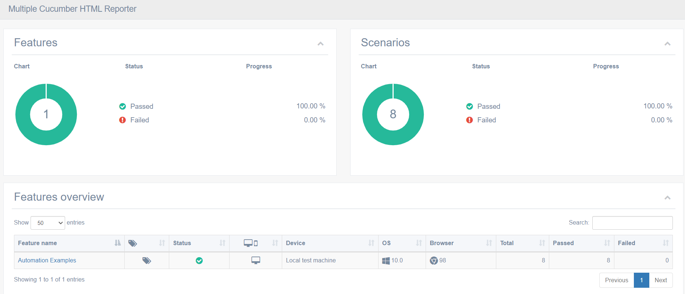

## Cypress BDD(Gherkin) E2E Test Automation Framework

## Overview
* This E2E BDD Test Automation Framework in JavaScript is using (Cypress, cypress-cucumber-preprocessor, multiple-cucumber-html-reporter).
* **Languages:** JavaScript/Node.JS
* **Build/Dependency Management:** npm
* **Testing Frameworks:** Cypress
* **BDD Library:** cypress-cucumber-preprocessor
* **Assertion Lib:** Cypress (inbuild Chai)
* **File Upload:** cypress-file-upload
* **Reporting:** multiple-cucumber-html-reporter

## Pre-requisites
* Install latest [Node.JS](https://nodejs.org/en/download/)
* Install latest [Visual Studio Code](https://code.visualstudio.com/download)
* Check access for Application Under Test [nextgenbo](https://nextgenbo.demo.devtls.net/auth/login)

## Setup Project
* Clone the source code from git as per below command.<br />
```git clone https://github.com/Kari1807/Stan_QA_Assessment_Cypress_Framework.git```
* Import the Project into Visual Studio Code 
* Open Terminal and Navigate to Project Directory
* Run `npm install` to download all the dependencies / libraries.
* Run `npm run cypress:open:local` to run the test using Cypress Runner in headed mode 
* Run `npm run cypress:run:local` to run all the test using Cypress CLI headless mode
* Run `npm run cypress:run:generate-report` to run all the test in CLI mode and generate cucumber html report
* Run `cypress:run:tags` to execute the tests based on smart cucumber tagging
* Run `cypress:run:feature` to execute the test for a particular feature
* Run `generate-report` to generate cucumber html report independently after test execution

## Results
* CLI Results


* cypress/cucumber-json and reports folders will be created under automatically after first run.
* HTML Report Path `./reports/cucumber-html/index.html` <br />


## Questions
**1. How did you decide on the structure and framework of your solution?**
* The simple Cypress-BDD(Gherkin) JavaScript Framework was chosen to provide a quick setup recipe and reusable solution for the users.
* Feature files are written in simple English using the npm package - cypress-cucumber-preprocessor. (Folder - cypress/integration/Features)
* The framework follows - Page Object design pattern to manage the Page Object separately, which helps with easy maintenance and code reusability. (Folder - cypress/integration/pageObjects)
* The Step Definition carries a function block with an expression that links it to one or more Gherkin steps. (Folder - cypress/support/step_definitions)
* The code optimization is done using commands.js feature provided by Cypress, which helps to create various custom commands and overwrite existing commands.
* The data driven approach (JSON file - cypress/fixtures) was used to pass data to every test case. It helps with reusability, maintainability, broader test coverage and better use of human skills. 
* The Cucumber html report is a simple HTML report which helps with Test Summary and Failure reason. It doesn't save the screenshot but carries information about the assertions and errors.

**2. Are there any improvements you could make to your submission?**
* I can add more details in the framework and optimize to make it more robust and dynamic. As of now, I have implemented whatever was possible in the available time frame, but it’s a simple recipe which is easy to understand, implement, and fit for the purpose. I won't say it is a complete framework solution because I believe quality checks, automation and improvements are an ongoing process.

**3. What would you do differently if you were allocated more time?**
* The Cypress Dashboard service is an optional web-based companion to the test runner, which provides timely, simple, and powerful insights on all your tests run briefly. I haven't enabled this feature, but it can be easily done.
* The CI integration can be easily achieved using Cypress Docker Image with any Integration tools like Jenkins, Circle CI etc.

**4. What did you think of this challenge?**
* Usually, QA challenges are typical where the companies asked to automate 1 / 2 test cases for any Demo Application. Those challenges can only test a limited knowledge on Web automation. 
* But I found this challenge from Stan very interesting, where wide range of challenges with different complexities are available on single page (majority of automation use cases). 
* In my projects, I haven’t got a chance to work on few use cases given in the challenges. And this gave me an opportunity to learn new things. Overall, I really loved the challenge and going to use this opportunity to automate remaining use cases for my self-learning.